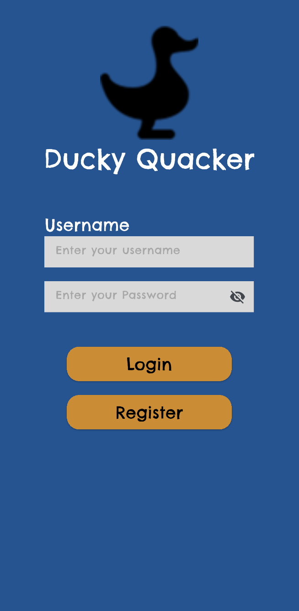
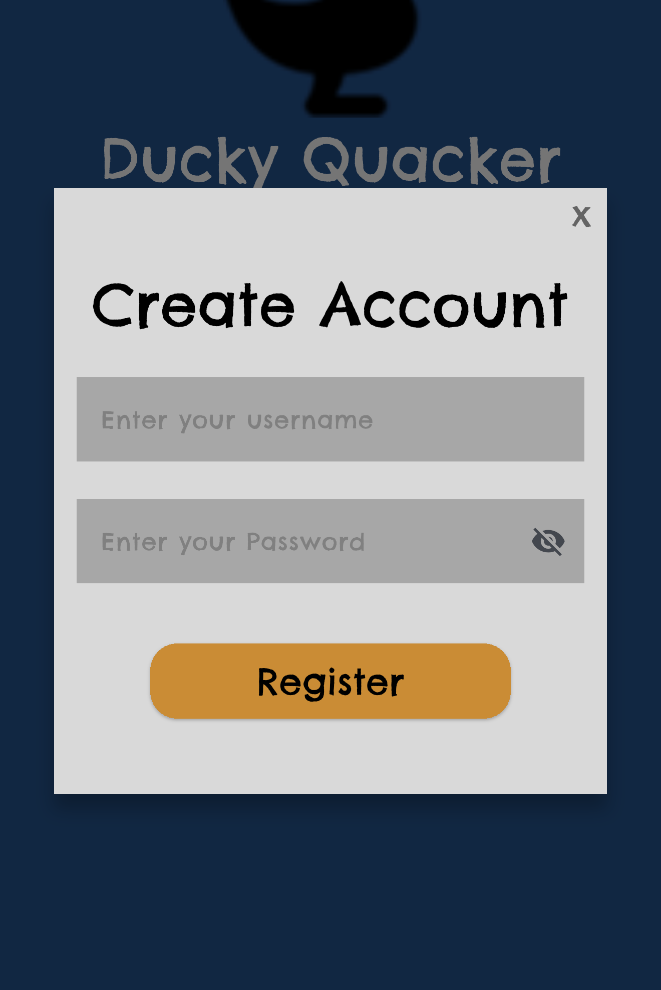
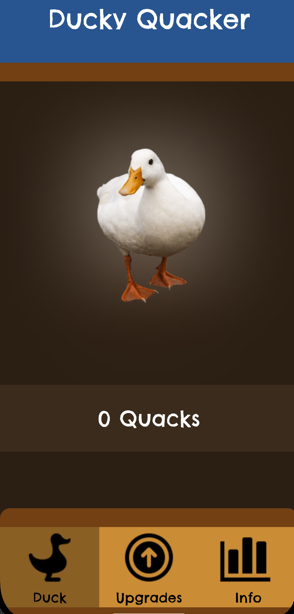
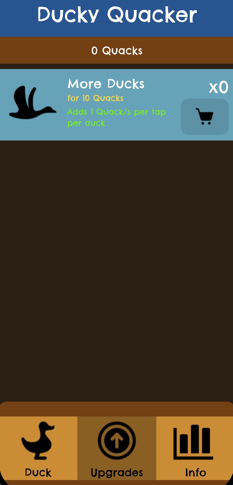
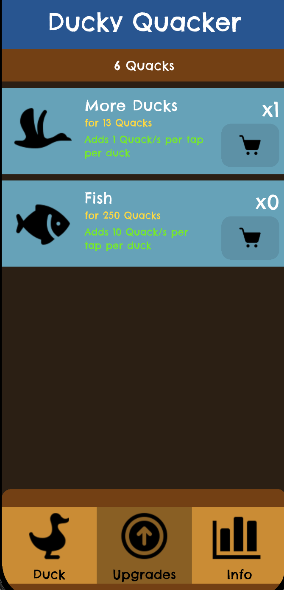
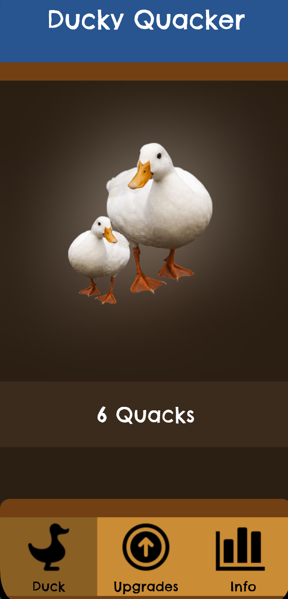
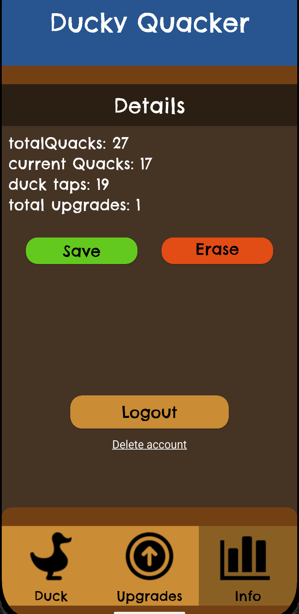

# Ducky Quacker: All about ducks

Quacky Tapper is a short game about making a Duck quack. Create and login to an account to have your own ducks to Quack! Quack more to get upgrades to quack even more!


## 🛠️ Prerequisites
Before running this project, ensure you have the following installed:
- Flutter SDK (v3.10 or later)
- Dart Frog CLI
- A working Android Emulator Simulator

## 🚀 Setup & Installation

### 1. Start the Server
First, you need to turn on the backend. Navigate to the `server` folder:
```bash
cd duck_api
dart_frog dev
```

**Note:** The server runs on `localhost:8080` by default.

### 2. Configure the App
Modify the `.env.development` file in the root directory of your Flutter project:
```env
BASE_URL=http://10.0.2.2:8080
```

Make sure to load the `.env` file in your app configuration (e.g., using the `flutter_dotenv` package).

### 3. Run the App
Open a new terminal, navigate to the root folder, and run:
```bash
flutter pub get
flutter run
```

## 📱 Features
* **Ducks**: An unassuming duck that you can tap to quack.
* **Duck Upgrades**: Treat your duck right and give it the love it deserves. Feed your duck with upgrades and it might just give you more quacks.
* **Dynamic Duck**: Every upgrade you buy gives the duck you quack some friends and food. Buy unique upgrades to make it happier!
* **Duck Sync**: Every owner has their own ducks saved in the duck server. If the owner disappears, so does the duck tied to it!

## 📸 Screenshots

### Login Screen


*Login screen with a working password visibility toggle on password*

### Login Screen


*Register Dialog Box*

### Duck Screen


*Screen where you quack the duck*

### Duck Upgrade Screen


*Screen to show upgrades that you can buy with quacks to get more quacks from duck tapping*

## Duck Upgrade Screen: Dynamic Display


*Next available upgrade becomes available once you buy the previous upgrade once*

## Duck Upgrade Screen: Dynamic Duck


*The Duck you quack reflects the upgrades you bought*

### Duck Details Screen


*Specific list of details in actions the user has done with the duck. Includes duck mood*

<!-- **Screenshot Guidelines:**
- **Local Reference**: `` - Store images in a `screenshots` folder in your repo
- **GitHub URL**: `` - Use full GitHub URL with `?raw=true`
- **External Hosting**: `` - Upload to Imgur, Cloudinary, or similar services -->


## 🔗 API Reference
Here are the endpoints available on the Dart Frog server:

| Method | Endpoint | Description |
|--------|----------|-------------|
| GET | `/accounts` | Fetches all accounts |
| GET | `/accounts/[id]` | Fetches a specific account by ID |
| GET | `/ducks` | Fetches all ducks |
| GET | `/ducks/[id]` | Fetches a specific duck by ID |

## 📁 Project Structure
```
duck_tapper/
├── duck_api/
| ├── 
├── assets/
│ ├── fonts/
│ │ └── ChelseaMarket-Regular.ttf
│ ├── images/
│ │ ├── Analytics.png
│ │ ├── Buy Upgrade.png
│ │ ├── DUCK 2.png
│ │ ├── DUCK FISH.png
│ │ ├── DUCK GROUP.png
│ │ ├── DUCK LAKE.png
│ │ ├── DUCK MELON.png
│ │ ├── DUCK PNG.png
│ │ ├── Duck.png
│ │ ├── Fish Food.png
│ │ ├── Flying Duck.png
│ │ ├── Lake.png
│ │ ├── Shopping Cart.png
│ │ └── Watermelon.png
├── lib/
│ ├── models/
│ ├── providers/
│ │ └── duck_provider.dart
│ ├── repositories/
│ ├── screens/
│ │ ├── details_screen.dart
│ │ ├── duck_screen.dart
│ │ ├── login_screen.dart
│ │ ├── nav_screen.dart
│ │ └── upgrade_screen.dart
│ └── main.dart
│ ├── screens/
│ │ ├── api_service.dart
│ │ └── login_check.dart
│ ├── widgets/
│ │ └── register_dialog.dart
├── screenshots/
│ ├── home_screen.png
│ ├── add_task.png
│ └── task_complete.png
├── test/
│ ├── unit_test.dart
│ ├── widget_test.dart
│ └── http_test.http
├── .env
└── README.md
```

### AI USAGE ACKNOWLEDGEMENT

AI was used sparingly within the App and API. Here are the only parts where AI has been utilized:

* Duck pressing animations
* Alternative Provider usage (DuckLogic chassis, everything within DuckLogic is typewritten and trial tested)
* Alternative Provider troubleshooting 
* Register Dialog Widget
